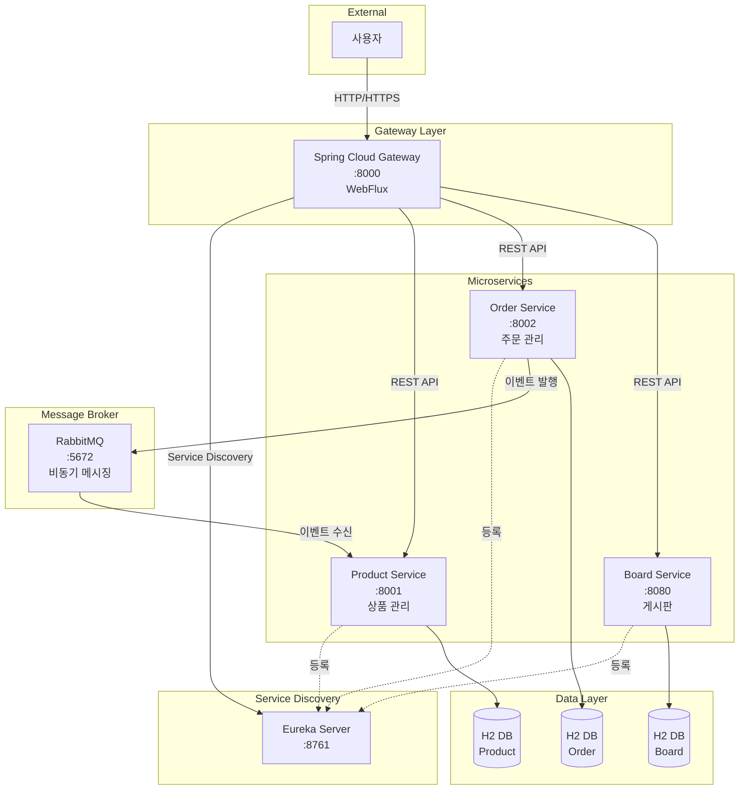
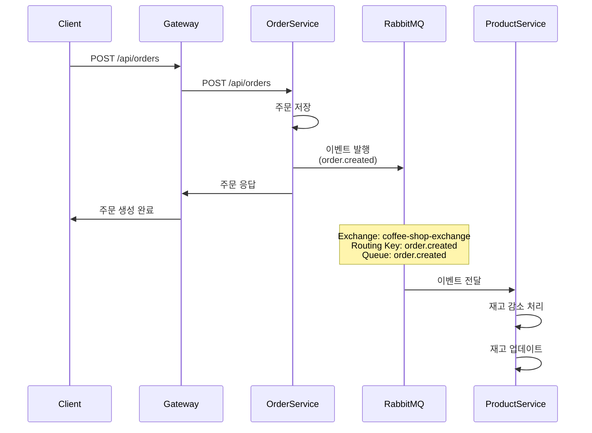
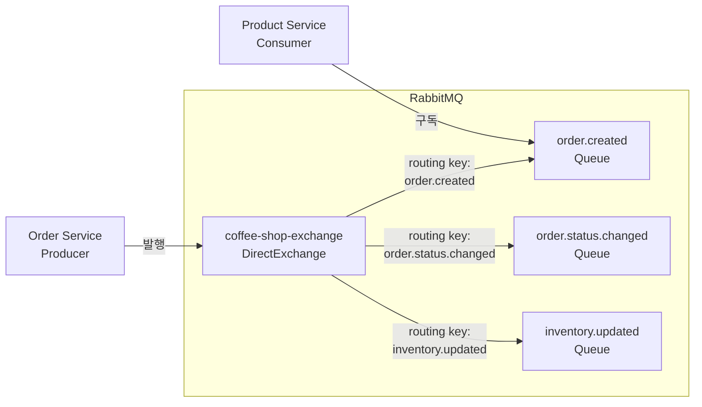
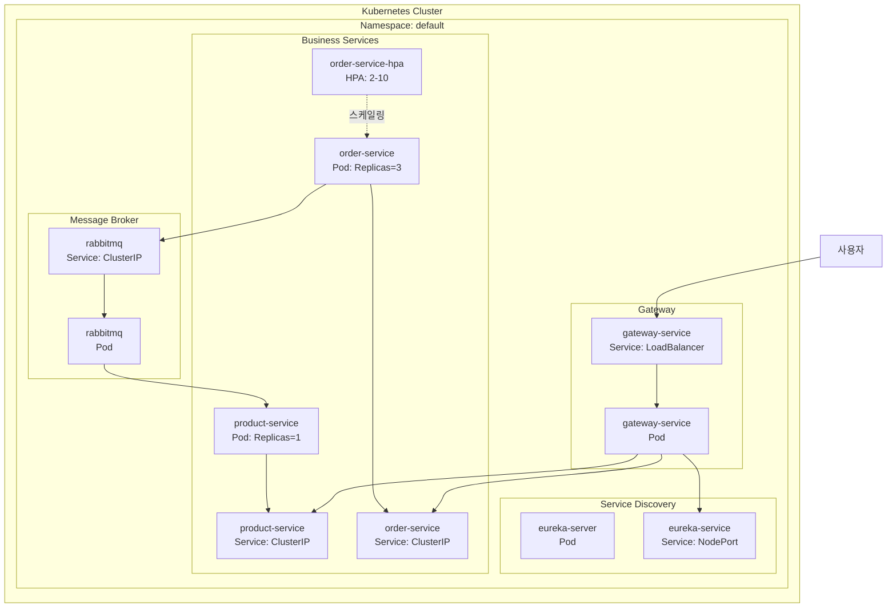
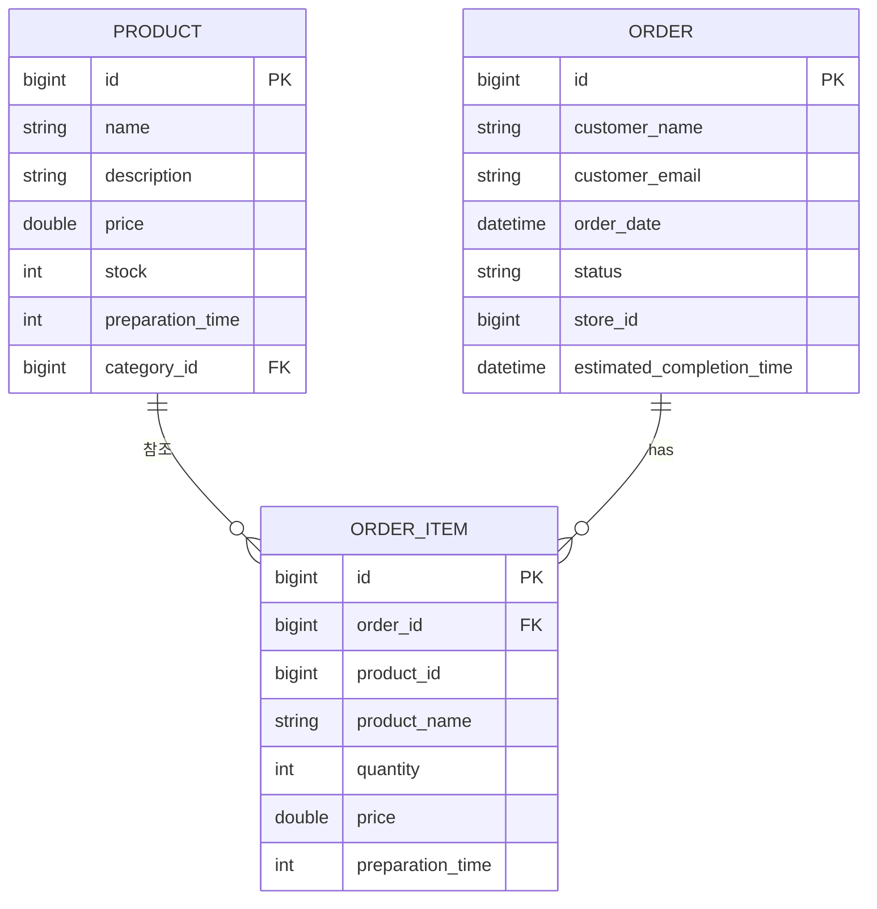
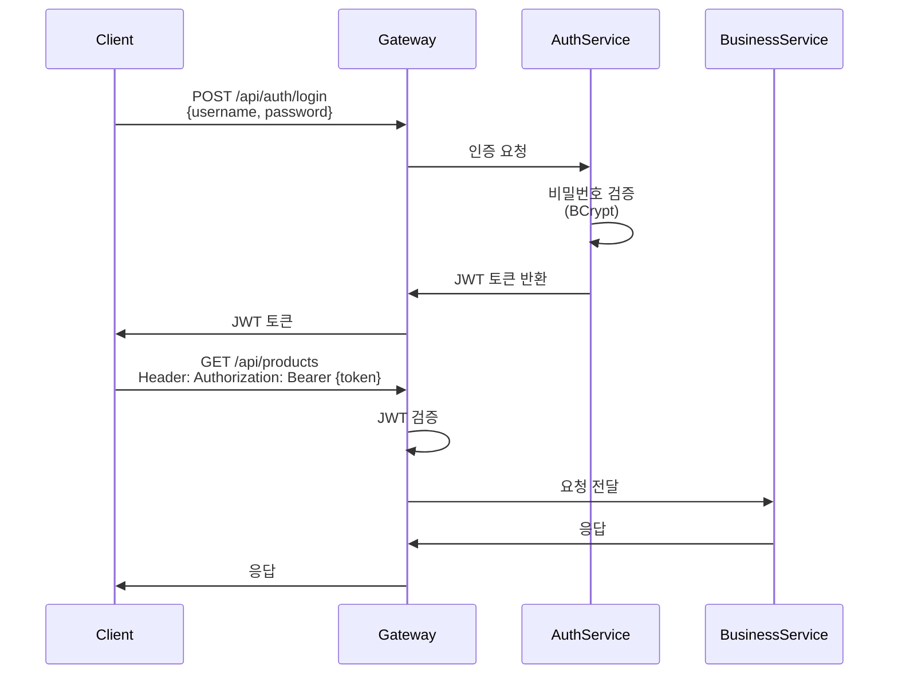

# 아키텍처 설계 문서

## 📐 MSA 아키텍처 개요

이 프로젝트는 **마이크로서비스 아키텍처(MSA)** 패턴을 따릅니다. 각 서비스는 독립적으로 개발, 배포, 확장 가능하며, 서비스 간 통신은 REST API와 비동기 메시징을 통해 이루어집니다.

---

## 🏛️ 아키텍처 다이어그램

### 전체 시스템 아키텍처



---

## 🔧 각 마이크로서비스 역할

### 1. Gateway Service (포트: 8000)

**역할**: API Gateway 패턴 구현

**주요 기능**:
- 모든 외부 요청의 단일 진입점
- 서비스 라우팅 및 로드 밸런싱
- 인증/인가 처리 (JWT)
- 프론트엔드 UI 제공
- CORS 처리

**기술 스택**:
- Spring Cloud Gateway
- Spring WebFlux (비동기, 논블로킹)
- Project Reactor

**왜 WebFlux를 사용하는가?**
- 높은 동시성 처리 능력
- 적은 리소스로 많은 요청 처리
- 논블로킹 I/O로 성능 향상

### 2. Eureka Server (포트: 8761)

**역할**: 서비스 디스커버리

**주요 기능**:
- 마이크로서비스 자동 등록
- 서비스 상태 모니터링
- 서비스 목록 제공
- 헬스 체크

**작동 방식**:
1. 각 서비스가 시작 시 Eureka에 자신을 등록
2. 주기적으로 하트비트 전송
3. Gateway가 Eureka에서 서비스 목록 조회
4. 동적으로 서비스 호출

### 3. Product Service (포트: 8001)

**역할**: 상품 관리 도메인

**주요 기능**:
- 상품 CRUD 작업
- 카테고리별 상품 조회
- 재고 관리
- 주문 이벤트 수신 및 재고 감소

**도메인 모델**:
- Product (상품)
- Category (카테고리)

**이벤트 처리**:
- `order.created` 이벤트 수신
- 재고 자동 감소 처리

### 4. Order Service (포트: 8002)

**역할**: 주문 관리 도메인

**주요 기능**:
- 주문 생성 및 관리
- 주문 상태 추적
- 주문 항목 관리
- 이벤트 발행

**도메인 모델**:
- Order (주문)
- OrderItem (주문 항목)

**이벤트 발행**:
- 주문 생성 시 `order.created` 이벤트 발행
- 주문 상태 변경 시 `order.status.changed` 이벤트 발행

### 5. Board Service (포트: 8080)

**역할**: 게시판 관리 도메인

**주요 기능**:
- 게시글 CRUD
- 댓글 기능
- 검색 기능

---

## 🔄 서비스 간 통신 방식

### 1. 동기 통신 (REST API)

**사용 시나리오**:
- Gateway → 각 서비스
- 클라이언트 → 서비스

**특징**:
- HTTP/HTTPS 프로토콜
- 요청-응답 패턴
- 동기식 처리

**예시**:
```java
// Gateway에서 Product Service 호출
@GetMapping("/api/products")
public List<Product> getAllProducts() {
    // Eureka를 통해 Product Service 주소 조회
    // HTTP GET 요청
    return productServiceClient.getAllProducts();
}
```

### 2. 비동기 통신 (RabbitMQ)

**사용 시나리오**:
- Order Service → Product Service (재고 감소)
- 이벤트 기반 아키텍처

**특징**:
- 메시지 큐를 통한 통신
- 비동기 처리
- 느슨한 결합 (Loose Coupling)
- 이벤트 기반 아키텍처

**예시**:
```java
// Order Service: 이벤트 발행
@PostMapping("/api/orders")
public Order createOrder(@RequestBody Order order) {
    Order savedOrder = orderRepository.save(order);
    
    // RabbitMQ로 이벤트 발행
    messageProducer.sendOrderCreatedEvent(savedOrder);
    
    return savedOrder;
}

// Product Service: 이벤트 수신
@RabbitListener(queues = "order.created")
public void handleOrderCreated(OrderDTO order) {
    // 재고 감소 처리
    for (OrderItemDTO item : order.getItems()) {
        productRepository.findById(item.getProductId())
            .ifPresent(product -> {
                product.setStock(product.getStock() - item.getQuantity());
                productRepository.save(product);
            });
    }
}
```

---

## 📨 RabbitMQ 메시지 플로우

### 메시지 흐름 다이어그램



### Exchange 및 Queue 구조



### 메시지 구조

**Order Created Event**:
```json
{
  "id": 1,
  "customerName": "홍길동",
  "customerEmail": "hong@example.com",
  "orderDate": "2024-01-15T10:30:00",
  "status": "PENDING",
  "items": [
    {
      "id": 1,
      "productId": 101,
      "productName": "아메리카노",
      "quantity": 2,
      "price": 4000.0,
      "preparationTime": 5
    }
  ]
}
```

---

## ☸️ Kubernetes 배포 구조

### 배포 아키텍처



### 주요 Kubernetes 리소스

#### 1. Deployment
- 각 서비스를 Pod로 배포
- ReplicaSet을 통한 복제본 관리
- 롤링 업데이트 지원

#### 2. Service
- **ClusterIP**: 내부 통신용 (기본)
- **NodePort**: 외부 접근용 (Eureka)
- **LoadBalancer**: 외부 로드 밸런서 (Gateway)

#### 3. HorizontalPodAutoscaler (HPA)
- Order Service에 적용
- CPU 사용률 기반 자동 스케일링
- 최소 2개, 최대 10개 Pod

### 배포 파일 구조

```
k8s/
├── gateway-deployment.yaml      # Gateway 배포
├── eureka-deployment.yaml       # Eureka 배포
├── product-deployment.yaml       # Product 배포
├── order-deployment.yaml         # Order 배포 + HPA
└── rabbitmq-deployment.yaml      # RabbitMQ 배포
```

---

## 🗄️ 데이터베이스 설계

### Database per Service 패턴

각 마이크로서비스는 독립적인 데이터베이스를 가집니다.



**주의사항**:
- 서비스 간 직접 DB 접근 금지
- API를 통해서만 데이터 접근
- 이벤트를 통한 데이터 일관성 유지

---

## 🔐 보안 아키텍처

### 인증/인가 플로우



---

## 📊 모니터링 및 관찰 가능성

### 로깅
- 각 서비스별 로그 수집
- 구조화된 로그 형식

### 헬스 체크
- Spring Boot Actuator
- Eureka 헬스 체크
- Kubernetes Liveness/Readiness Probe

### 메트릭
- CPU, 메모리 사용률
- 요청 처리량
- 응답 시간

---

## 🎯 아키텍처 결정 사항

### 1. 왜 MSA를 선택했는가?
- **확장성**: 각 서비스를 독립적으로 확장 가능
- **기술 다양성**: 서비스별로 다른 기술 스택 사용 가능
- **장애 격리**: 한 서비스의 장애가 다른 서비스에 영향 최소화
- **팀 독립성**: 팀별로 독립적인 개발 및 배포 가능

### 2. 왜 RabbitMQ를 사용하는가?
- **비동기 처리**: 주문 생성과 재고 감소를 비동기로 처리
- **느슨한 결합**: 서비스 간 직접 의존성 제거
- **이벤트 기반**: 이벤트 기반 아키텍처 구현
- **신뢰성**: 메시지 지속성 및 재시도 지원

### 3. 왜 Eureka를 사용하는가?
- **자동 서비스 발견**: 동적 서비스 등록 및 발견
- **로드 밸런싱**: 클라이언트 사이드 로드 밸런싱
- **헬스 체크**: 서비스 상태 모니터링
- **Spring Cloud 통합**: Spring Cloud 생태계와 완벽 통합

### 4. 왜 Database per Service를 사용하는가?
- **독립성**: 각 서비스의 데이터 독립성 보장
- **확장성**: 서비스별로 다른 DB 선택 가능
- **장애 격리**: 한 서비스의 DB 장애가 다른 서비스에 영향 없음

---

## 🚀 확장 계획

### 향후 개선 사항
1. **분산 추적**: Zipkin 또는 Jaeger 도입
2. **중앙화된 로깅**: ELK Stack 또는 Loki
3. **API 버전 관리**: API 버전별 라우팅
4. **서킷 브레이커**: Resilience4j 도입
5. **Config Server**: 중앙화된 설정 관리
6. **인증 서비스 분리**: 별도의 Auth Service

---

이 문서는 프로젝트의 아키텍처를 이해하는 데 도움이 됩니다. 더 자세한 내용은 각 서비스의 코드를 참고하세요.

