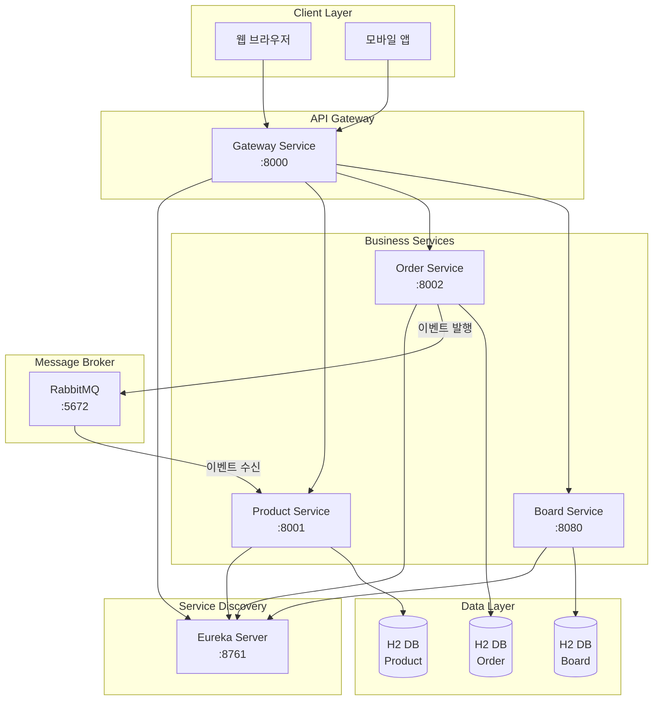

# Coffee Shop MSA 프로젝트

## 📋 프로젝트 개요

이 프로젝트는 **Spring Boot 3.1.5** 기반의 **마이크로서비스 아키텍처(MSA)** 예제 프로젝트입니다. 
카페 주문 관리 시스템을 MSA로 구현하여, 실제 운영 환경에서 사용할 수 있는 수준의 아키텍처와 패턴을 학습하고 구현합니다.

### 프로젝트 목표

- **MSA 아키텍처** 이해 및 구현
- **서비스 디스커버리** 패턴 학습 (Eureka)
- **API Gateway** 패턴 구현 (Spring Cloud Gateway)
- **비동기 메시징** 구현 (RabbitMQ)
- **Kubernetes** 배포 및 운영
- **이벤트 기반 아키텍처** 구현

---

## 🏗️ 시스템 아키텍처



### 아키텍처 설명

1. **Client Layer**: 웹 브라우저나 모바일 앱이 Gateway를 통해 시스템에 접근
2. **API Gateway**: 모든 외부 요청의 진입점, 라우팅 및 인증/인가 처리
3. **Service Discovery**: Eureka를 통한 서비스 자동 등록 및 발견
4. **Business Services**: 각 도메인별 독립적인 마이크로서비스
5. **Message Broker**: RabbitMQ를 통한 비동기 이벤트 기반 통신
6. **Data Layer**: 각 서비스별 독립적인 데이터베이스 (Database per Service 패턴)

---

## 🛠️ 기술 스택

### Backend
- **Spring Boot 3.1.5**: 마이크로서비스 프레임워크
- **Spring Cloud 2022.0.4**: 클라우드 네이티브 기능
- **JDK 17**: Java 개발 환경
- **Gradle 8.8**: 빌드 도구
- **Spring Cloud Gateway**: API Gateway (WebFlux 기반)
- **Netflix Eureka**: 서비스 디스커버리
- **Spring AMQP**: RabbitMQ 통신
- **Spring Data JPA**: 데이터 접근 계층
- **H2 Database**: 인메모리 데이터베이스

### Frontend
- **Vue.js 3**: 프론트엔드 프레임워크
- **TypeScript**: 타입 안정성
- **Pinia**: 상태 관리
- **Bootstrap 5**: UI 프레임워크
- **Vite**: 빌드 도구

### Infrastructure
- **Docker**: 컨테이너화
- **Kubernetes**: 오케스트레이션
- **RabbitMQ**: 메시지 브로커

### Security
- **JWT (JSON Web Token)**: 인증 토큰
- **BCrypt**: 비밀번호 암호화

---

## 🎯 주요 기능

### 1. 사용자 인증 및 권한 관리
- JWT 기반 인증 시스템
- 역할 기반 접근 제어 (RBAC)
- BCrypt를 사용한 비밀번호 암호화
- 세션 관리

### 2. 상품 관리 (Product Service)
- 상품 CRUD 작업
- 카테고리별 상품 조회
- 재고 관리
- 재고 자동 감소 (주문 이벤트 수신 시)

### 3. 주문 관리 (Order Service)
- 주문 생성 및 관리
- 주문 상태 추적
- 주문 항목 관리
- 주문 생성 시 이벤트 발행

### 4. 게시판 관리 (Board Service)
- 게시글 CRUD
- 댓글 기능
- 검색 기능

### 5. 이벤트 기반 통신
- 주문 생성 시 Product Service에 재고 감소 이벤트 전송
- RabbitMQ를 통한 비동기 메시징
- 이벤트 기반 아키텍처 구현

### 6. 서비스 디스커버리
- Eureka를 통한 자동 서비스 등록
- 동적 서비스 발견
- 로드 밸런싱

### 7. API Gateway
- 단일 진입점 제공
- 라우팅 및 로드 밸런싱
- 인증/인가 처리
- 프론트엔드 UI 제공

---

## 📁 프로젝트 구조

```
k8s_msa/
├── gateway-service/          # API Gateway 서비스
│   ├── src/
│   │   ├── main/
│   │   │   ├── java/        # Spring Boot 애플리케이션
│   │   │   └── resources/   # 설정 파일
│   │   └── test/
│   ├── Dockerfile           # Docker 이미지 빌드
│   └── build.gradle         # Gradle 빌드 설정
│
├── eureka-server/           # 서비스 디스커버리 서버
│   └── ...
│
├── product-service/         # 상품 관리 서비스
│   ├── src/
│   │   └── main/
│   │       ├── java/
│   │       │   └── com/example/product/
│   │       │       ├── config/      # RabbitMQ 설정
│   │       │       ├── controller/  # REST API
│   │       │       ├── messaging/   # 메시지 Consumer
│   │       │       ├── model/       # 엔티티
│   │       │       └── repository/  # 데이터 접근
│   │       └── resources/
│   └── Dockerfile
│
├── order-service/           # 주문 관리 서비스
│   ├── src/
│   │   └── main/
│   │       ├── java/
│   │       │   └── com/example/order/
│   │       │       ├── config/      # RabbitMQ 설정
│   │       │       ├── controller/  # REST API
│   │       │       ├── messaging/   # 메시지 Producer
│   │       │       ├── model/       # 엔티티
│   │       │       └── repository/  # 데이터 접근
│   │       └── resources/
│   └── Dockerfile
│
├── board-service/          # 게시판 서비스
│   └── ...
│
├── gateway-ui/              # Vue.js 프론트엔드
│   ├── src/
│   │   ├── components/     # Vue 컴포넌트
│   │   ├── views/          # 페이지 뷰
│   │   ├── router/          # 라우팅 설정
│   │   └── stores/         # 상태 관리
│   └── package.json
│
├── k8s/                     # Kubernetes 배포 파일
│   ├── gateway-deployment.yaml
│   ├── eureka-deployment.yaml
│   ├── product-deployment.yaml
│   ├── order-deployment.yaml
│   └── rabbitmq-deployment.yaml
│
├── build.gradle             # 루트 빌드 설정
├── settings.gradle          # 프로젝트 설정
├── gradlew                  # Gradle Wrapper
└── docs/                    # 문서
    ├── README.md
    ├── ARCHITECTURE.md
    ├── TROUBLESHOOTING.md
    ├── DEVELOPMENT.md
    └── API.md
```

---

## 🚀 빠른 시작

### 사전 요구사항
- JDK 17 이상
- Gradle 8.8 이상
- Docker (선택사항)
- Kubernetes (선택사항)

### 로컬 실행

1. **프로젝트 클론**
```bash
git clone <repository-url>
cd k8s_msa
```

2. **각 서비스 실행**
```bash
# Eureka Server 실행
cd eureka-server
../gradlew bootRun

# Product Service 실행 (새 터미널)
cd product-service
../gradlew bootRun

# Order Service 실행 (새 터미널)
cd order-service
../gradlew bootRun

# Gateway Service 실행 (새 터미널)
cd gateway-service
../gradlew bootRun
```

3. **RabbitMQ 실행** (Docker 사용)
```bash
docker run -d --name rabbitmq -p 5672:5672 -p 15672:15672 rabbitmq:3-management
```

4. **접속**
- Gateway: http://localhost:8000
- Eureka Dashboard: http://localhost:8761
- RabbitMQ Management: http://localhost:15672 (guest/guest)

---

## 📚 문서

- [ARCHITECTURE.md](./ARCHITECTURE.md) - 아키텍처 상세 설명
- [DEVELOPMENT.md](./DEVELOPMENT.md) - 개발 환경 설정
- [API.md](./API.md) - API 문서
- [TROUBLESHOOTING.md](./TROUBLESHOOTING.md) - 문제 해결 가이드

---

## 🤝 기여

이 프로젝트는 학습 목적으로 만들어졌습니다. 개선 사항이나 버그 리포트는 이슈로 등록해주세요.

---

## 📄 라이선스

이 프로젝트는 교육 목적으로 자유롭게 사용할 수 있습니다.

